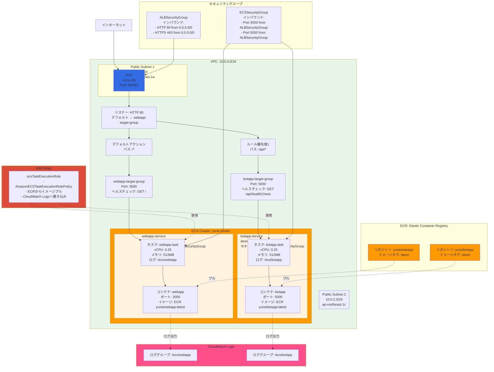

# ECS アーキテクチャ図

## 構成図

## コンポーネント詳細

### ECR (Elastic Container Registry)
- `yuria/webapp` - Next.jsアプリのイメージ
- `yuria/botapp` - Botアプリのイメージ

### ECSクラスター: yuria-cluster
1つのクラスターで複数のサービスを管理

#### サービス1: webapp-service
- タスク定義: webapp-task
- desired count: 1
- コンテナポート: 3000

#### サービス2: botapp-service
- タスク定義: botapp-task
- desired count: 1
- コンテナポート: 5000

### ALB (Application Load Balancer)
パスベースルーティング:
- `/*` → webapp-target-group → webappコンテナ
- `/api/*` → botapp-target-group → botappコンテナ

### ターゲットグループ
- webapp-target-group: 
  - ポート: 3000
  - ヘルスチェック: GET `/` (HTTPステータス200期待)
- botapp-target-group: 
  - ポート: 5000
  - ヘルスチェック: GET `/api/healthCheck` (HTTPステータス200期待)

## データフロー

1. ユーザーがALBにアクセス
2. ALBがパスを見て適切なターゲットグループに転送
3. ターゲットグループが対応するECSタスクに転送
4. タスク（コンテナ）がリクエストを処理
5. レスポンスを返す

## デプロイフロー

1. ローカルでDockerイメージをビルド
2. ECRにプッシュ
3. ECSサービスを更新（force-new-deployment）
4. 新しいタスクが起動し、古いタスクと入れ替わる
